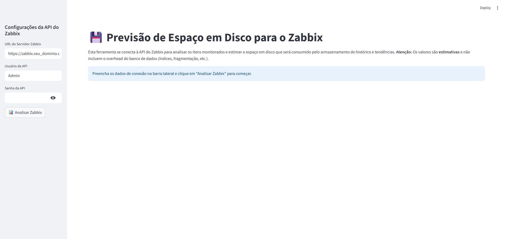

# 💾 Zabbix Disk Usage Forecaster

Uma ferramenta web, construída com Streamlit, para se conectar à API do Zabbix e prever o uso de espaço em disco que será consumido pelo armazenamento de dados de histórico (`history`) e tendências (`trends`).

Esta ferramenta ajuda administradores de sistemas e analistas de monitoramento a planejar a capacidade do banco de dados do Zabbix e a identificar os itens que mais consomem espaço.




---

## 🚀 Funcionalidades

* **Interface Web Amigável**: Não é necessário editar o código para usar. Basta preencher os dados de conexão e clicar em um botão.
* **Análise Detalhada**: Fornece uma tabela com a previsão de uso de disco para cada item monitorado.
* **Métricas de Resumo**: Exibe cartões com os totais gerais (histórico, tendências e total combinado) para uma visão rápida.
* **Exportação de Dados**: Permite baixar a análise completa em um arquivo CSV para análise posterior em planilhas.
* **Cache Inteligente**: Armazena em cache os resultados da API para evitar sobrecarga no servidor Zabbix e acelerar recarregamentos da página.

---

## 🔧 Instalação e Pré-requisitos

Você precisará do Python 3.7 ou superior instalado em sua máquina.

**1. Clone o repositório ou baixe os arquivos:**
   - `app.py`
   - `requirements.txt`
   - `README.md`

**2. Crie um ambiente virtual (recomendado):**
   Isso isola as dependências do projeto.
   ```bash
   python3 -m venv venv
   source venv/bin/activate
   # No Windows, use: venv\Scripts\activate
   ```

**3. Instale as dependências:**
   Navegue até a pasta do projeto e execute o comando abaixo para instalar as bibliotecas listadas no `requirements.txt`.
   ```bash
   pip install -r requirements.txt
   ```

---

## ▶️ Como Executar

1.  Com o ambiente virtual ativado, execute o seguinte comando no seu terminal:
    ```bash
    streamlit run app.py
    ```
2.  O Streamlit iniciará um servidor local e abrirá a aplicação no seu navegador padrão.

3.  Na interface web:
    * Preencha a **URL do Servidor Zabbix**, o **Usuário da API** e a **Senha da API** na barra lateral esquerda.
    * Clique no botão **"📊 Analisar Zabbix"**.
    * Aguarde a ferramenta buscar os dados e exibir os resultados na tela principal.

---

## 📈 Como a Previsão Funciona

É crucial entender que os resultados são **ESTIMATIVAS**. O cálculo é baseado nas seguintes premissas:

* **Tamanho por Valor de Histórico**:
    * **50 bytes** para tipos numéricos (inteiro, float).
    * **256-512 bytes** para tipos de texto (caractere, log, texto). O tamanho real de itens de texto pode variar drasticamente.

* **Tamanho por Registro de Tendência**:
    * **128 bytes** por registro. O Zabbix armazena um registro de tendência por hora, contendo valores agregados (min, max, média, etc.).

### ⚠️ O que **NÃO** está incluído no cálculo:

O fator mais importante que diferencia a estimativa do uso real é o **overhead do banco de dados**. O cálculo **não considera**:

* **Índices**: As tabelas `history*` e `trends*` possuem múltiplos índices que consomem um espaço significativo em disco, muitas vezes comparável ao tamanho dos próprios dados.
* **Overhead de Tabelas e Linhas**: Cada SGBD (MySQL, PostgreSQL) adiciona seus próprios metadados a tabelas e linhas.
* **Fragmentação e Espaço Livre**: O banco de dados aloca espaço em blocos (páginas), o que pode levar a espaço não utilizado dentro dos arquivos de dados.
* **Outras Tabelas do Zabbix**: O tamanho de tabelas como `events`, `alerts`, `triggers`, etc., não é contabilizado, embora geralmente representem uma porção menor do uso total.

Use esta ferramenta como uma excelente **ordem de grandeza** para o planejamento de capacidade, mas sempre monitore o crescimento real do seu banco de dados.

---

## 📄 Licença

Distribuído sob a licença MIT. Veja o arquivo `LICENSE` para mais informações.
